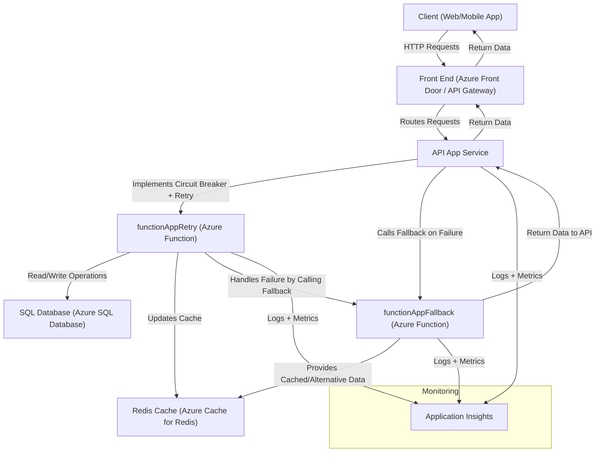

# Circuit Breaker Pattern on Azure

This repository demonstrates the implementation of the **Circuit Breaker Pattern** on Azure, utilizing various Azure services to build a resilient, scalable, and fault-tolerant application architecture.

The architecture integrates multiple cloud patterns, including **Circuit Breaker**, **Cache-Aside**, **API Gateway Offloading**, **Retry Pattern**, and **Fallback Pattern** to handle transient faults, manage retries, and provide alternative responses in case of failures.

## 🏗️ Architecture Overview

The architecture consists of the following components:

1. **Azure Front Door** or **API Gateway**: Acts as the main entry point for incoming client requests and routes them to the API App Service.
2. **API App Service**: Implements the Circuit Breaker and Retry logic. It handles incoming client requests and delegates tasks to the appropriate Azure Functions.
3. **Retry Azure Function**: Handles normal operations, such as reading/writing to the SQL Database and updating the Redis cache.
4. **Fallback Azure Function**: Provides cached or alternative data when the main services are unavailable.
5. **Azure Cache for Redis**: Caches data to reduce load on the SQL Database and improve performance.
6. **Azure SQL Database**: Stores data persistently for the application.
7. **Azure Static Web App**: Hosts the React TypeScript front-end application, allowing users to interact with the API.
8. **Application Insights**: Monitors and collects logs, metrics, and telemetry data from all services.

### 📊 Architectural Diagram



## 📋 Prerequisites

To deploy and run this solution, you will need:

- **Azure Subscription**: An active Azure subscription.
- **Azure CLI**: Install the Azure CLI tool on your local machine.
- **GitHub Account**: A GitHub account to fork and clone the repository.
- **GitHub Secrets**: Required secrets added to your GitHub repository settings for automated deployment.

## 🚀 Getting Started

### 1. Fork and Clone the Repository

1. **Fork** this repository to your own GitHub account.
2. **Clone** the forked repository to your local machine:

   ```bash
   git clone https://github.com/<your-username>/circuit-breaker-pattern-azure.git
   cd circuit-breaker-pattern-azure
   ```

### 2. Set Up GitHub Secrets

Add the following secrets to your GitHub repository:

- **`AZURE_CLIENT_ID`**: Azure service principal client ID.
- **`AZURE_CLIENT_SECRET`**: Azure service principal client secret.
- **`AZURE_TENANT_ID`**: Azure tenant ID.
- **`AZURE_SUBSCRIPTION_ID`**: Azure subscription ID.
- **`AZURE_FUNCTIONAPP_RETRY_NAME`**: Name of the Retry Azure Function App.
- **`AZURE_FUNCTIONAPP_RETRY_PUBLISH_PROFILE`**: Publish profile for the Retry Function App.
- **`AZURE_FUNCTIONAPP_FALLBACK_NAME`**: Name of the Fallback Azure Function App.
- **`AZURE_FUNCTIONAPP_FALLBACK_PUBLISH_PROFILE`**: Publish profile for the Fallback Function App.
- **`AZURE_API_APP_NAME`**: Name of the API App Service.
- **`AZURE_API_APP_PUBLISH_PROFILE`**: Publish profile for the API App Service.
- **`AZURE_STATIC_WEB_APPS_API_TOKEN`**: API token for deploying the Azure Static Web App.

### 3. Deploy the Infrastructure

1. **Deploy Azure Resources**:

   - The deployment of Azure resources is automated using GitHub Actions. To deploy the infrastructure:
   - Push changes to the `main` branch or manually trigger the `deploy-bicep.yml` workflow located in the **`infrastructure/.github/workflows/`** folder.

### 4. Deploy the Application Components

1. **API App Service**:
   - Push changes to the `main` branch or manually trigger the `deploy-api-app-service.yml` workflow in the **`api-app-service/.github/workflows/`** folder.

2. **Retry and Fallback Azure Functions**:
   - Push changes to the `main` branch or manually trigger the `deploy-retry-function.yml` and `deploy-fallback-function.yml` workflows in their respective folders.

3. **Static Web App**:
   - Push changes to the `main` branch or manually trigger the `deploy-static-web-app.yml` workflow in the **`static-web-app/.github/workflows/`** folder.

## 🧪 Testing the Solution

1. **Access the Static Web App**:
   - Open the URL of the Azure Static Web App to access the front-end application.

2. **Interact with the API**:
   - Use the input fields and buttons to perform operations. Observe the behavior when backend services are available or simulate failures to see the Circuit Breaker pattern in action.

3. **Monitor with Application Insights**:
   - Use Azure Application Insights to monitor logs, metrics, and telemetry data for all services.

## 📝 License

This project is licensed under the MIT License - see the [LICENSE](LICENSE) file for details.

## 🙌 Contributing

Contributions are welcome! Please open an issue or submit a pull request for any improvements or suggestions.

## 📞 Support

If you have any questions or need support, please open an issue or contact the repository maintainer.

## 🏷️ Tags

#Azure #CloudComputing #DevOps #CircuitBreakerPattern #Resilience #Microservices